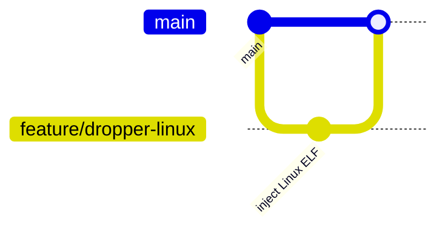

# LISA Project – Dropper and Agent System

## Usage

Our project consists of a complete system simulating realistic user and attacker behaviors using cross-platform agents and droppers. It also includes a backend API and frontend admin panel for visualization and control.

### 🐧 Running the Linux Dropper

1. Build the Linux agent using `build_script.sh` provided by the agent team.
2. Compile the agent using either:
   - `Nuitka --onefile --standalone` (generates a standalone ELF)
   - or convert it to shellcode using **donut**
3. Use the Linux dropper to inject the agent:

```bash
sudo ./dropper bash agent.bin
```

- The dropper searches for the specified process, allocates memory using `mmap`, and injects the agent.

### 🪟 Running the Windows Dropper

1. Compile the Windows agent using Nuitka or PyInstaller.
2. Run the dropper:

```cmd
dropper.exe explorer.exe agent.exe
```

- Uses Windows APIs to locate process, allocate memory, and inject agent.

### ⚙️ Agent Example Behavior

- Logs system commands.
- Simulates developer/admin/user activity.
- Sends activity logs to backend or stores locally.

---

## Development

### 📋 Kanban Board

We use a GitHub Project Kanban board: 👉 [Kanban Board Link](https://github.com/orgs/LISA-SWP25/projects/4/views/1)

#### Columns & Criteria:

- **To Do:** Issue is defined with description and template.
- **In Progress:** Developer assigned and branch created.
- **In Review:** PR created and linked to issue.
- **Ready to Deploy:** PR reviewed and approved.
- **User Testing:** Ready for testing on staging.
- **Done:** Confirmed working in production.

---

### 🧠 Git Workflow

We use **GitHub Flow**:

- Branches: `feature/xyz`, `bugfix/abc`
- Commits follow `[#[issue-number]] <summary>`
- PRs include description, screenshots if needed, and issue references
- All PRs require review & approval

#### Gitgraph Example:



---

## Architecture

### 📦 Static View

**Components:**

- **Backend** (FastAPI): manages agent configs, user roles, logs
- **Frontend** (React): control panel and visualization
- **Agents**:
  - Linux agent (Python, compiled via Nuitka or PyInstaller)
  - Windows agent (Python, compiled)
- **Droppers**:
  - Inject ELF or EXE into processes
  - Use ptrace (Linux) or VirtualAllocEx + CreateRemoteThread (Windows)

🖼 UML Component Diagram: `docs/architecture/static-view/component-diagram.png`

### 🔄 Dynamic View

Scenario:

1. Agent is compiled and uploaded.
2. Dropper selects target process.
3. Dropper injects agent payload into memory.
4. Agent runs in background.
5. Logs are sent to backend.

🖼 UML Sequence Diagram: `docs/architecture/dynamic-view/sequence-diagram.png`

### ☁️ Deployment View

- Backend hosted on cloud server
- CI/CD via GitHub Actions
- Agents dropped via local droppers
- Frontend deployed via GitHub Pages or Docker

🖼 UML Deployment Diagram: `docs/architecture/deployment-view/deployment-diagram.png`

---

## Quality

### 🔐 Security

- Agents are injected directly into memory
- No files left on disk (optional mode)
- Masquerade as GUI/background processes

### ⚙️ Reliability

- Injected agents do not crash host processes
- Graceful failure handling in droppers
- Process PID verification and fallback

### 🧹 Maintainability

- Modular structure for droppers/agents/backend
- Documented API routes and injection mechanisms
- CI pipeline with automated checks

---

## Quality Tools Used

| Tool               | Type              | Purpose                                         |
| ------------------ | ----------------- | ----------------------------------------------- |
| **pytest**         | Testing Framework | Unit & integration testing                      |
| **flake8**         | Linter            | Code quality enforcement                        |
| **GitHub Actions** | CI Tool           | Automates tests and linting on PR               |
| **Postman**        | API Testing Tool  | Backend API validation                          |
| **Nuitka**         | Build Tool        | Converts Python agents into executable binaries |

---

## README Publishing

This documentation is ready to be published via **GitHub Pages** using [mdBook](https://rust-lang.github.io/mdBook/):

- Sidebar navigation
- Table of contents
- `/docs/` or `/book/` output available after `mdbook build`

For setup instructions, see `docs/setup/ghpages_instructions.md`.

