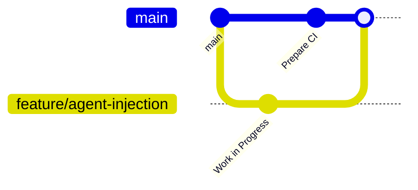

# LISA Project – Dropper and Agent System

## Usage

Our project consists of multi-platform droppers that inject Linux and Windows agents into live processes using advanced techniques.

### Running the Linux Dropper:

1. Build the agent using `build_script.sh` provided by the agent team.
2. Convert the agent to shellcode using **donut** or compile it using **Nuitka --standalone**.
3. Run the dropper and provide the target process name and payload:

```bash
sudo ./dropper bash agent.bin
```

### Access Instructions:

- GUI process example: `konsole`, `dolphin`.
- Debug files: Temporary debug files can be found under `/tmp`.

---

## Development

### Kanban Board

We use a GitHub Project Kanban board:\
[Kanban Board Link](https://github.com/orgs/LISA-SWP25/projects/4/views/1)

#### Kanban Columns and Entry Criteria:

- **To Do:** Issues are fully described and linked to a user story/bug/technical task template.
- **In Progress:** Issue is assigned to a developer and a dedicated branch is created.
- **In Review:** Pull Request (PR) is created and linked to the issue.
- **Ready to Deploy:** PR is reviewed and approved by at least one team member.
- **User Testing:** Feature deployed and available for internal/customer review.
- **Done:** Feedback is collected and integrated (if applicable).

### Git Workflow

We follow **GitHub Flow**:

- Issues created using predefined templates (User Story, Bug Report, Technical Task).
- Branches named as `feature/issue-number-description`, `bugfix/issue-number-description`.
- Commit messages follow:\
  `[#issue-number] <Short Description>`
- PRs must reference the related issue and use the PR template.
- Reviews and approvals are mandatory before merging.
- Merging is done via "Squash and Merge" to keep history clean.

#### Gitgraph Diagram:



### Secrets Management

We use:

- `.env` files for local development (excluded from version control).
- Secrets like database passwords, API keys, and SSH keys are passed via GitHub Actions Secrets in CI.
- Docker containerization is used to manage build-time secrets.

### Automated Tests

#### Tools Used:

- `pytest` – Unit and integration testing.
- GitHub Actions – CI pipeline.
- `flake8` – Linter for static analysis.

#### Test Coverage:

- Unit tests cover core functionalities (minimum 5 tests per critical component).
- Integration tests cover dropper-agent interaction.

### Continuous Integration

- CI workflow: [GitHub Actions CI](https://github.com/orgs/LISA-SWP25/actions)
- Tools:
  - `flake8` for linting.
  - `pytest` for unit and integration tests.
- CI ensures that all tests pass before merging.

### Continuous Deployment

- CD is not implemented yet. CI is fully functional.

---

## Architecture

### Static View

The system consists of:

- Backend (configuration and control center).
- Frontend (admin panel).
- Multi-platform agents (Linux, Windows).
- Dropper (multi-platform, capable of memory injection).

Coupling between droppers and agents is minimal. Components are loosely coupled to enhance maintainability.

UML Component Diagram: [docs/architecture/static-view/component-diagram.png]

### Dynamic View

UML Sequence Diagram: [docs/architecture/dynamic-view/sequence-diagram.png]

#### Example Scenario:

1. Dropper downloads agent.
2. Dropper locates a live process.
3. Dropper injects agent into memory.
4. Agent executes payload.
5. Logs generated.

Execution time in production: \~3-5 seconds per injection.

### Deployment View

Deployment Diagram: [docs/architecture/deployment-view/deployment-diagram.png]

- Backend is deployed on a cloud server.
- Droppers are distributed to client machines.
- Agents operate inside injected processes.
- Docker is used to containerize services where applicable.

---

## Quality

### Security

- Memory-only injection (no disk footprint).
- Process masquerading to minimize detection.

### Reliability

- Dropper terminates gracefully.
- Ensures proper process attachment and memory allocation.

### Maintainability

- Modular components.
- Well-documented Git workflow.
- Clean branching and merging strategy.

### Quality Scenarios

All quality scenarios are documented in:\
[docs/quality/quality-scenarios.md]

