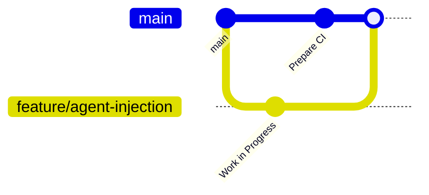

#  LISA: Living Infrastructure Simulator Agent

## Description 

LISA is a system that simulates realistic user behavior within an isolated training infrastructure of a cyber range. The purpose of the system is to create a background of "peaceful" activity that enables conducting detection and incident analysis training in conditions close to real ones. 

## System Requirements and Setup (for customer)

This section is crucial for customers as it ensures proper deployment and functionality of LISA within your cyber range environment. Understanding these requirements prevents compatibility issues and ensures optimal performance during security training exercises.

### Prerequisites

Before deploying LISA in your training infrastructure, ensure the following components are available:

#### Operating System Support
- **Linux**: Ubuntu 18.04+, CentOS 7+, or equivalent distributions
- **Windows**: Windows 10/11, Windows Server 2016+
- **Architecture**: x86_64 (64-bit) required for both platforms

#### System Resources
- **RAM**: Minimum 4GB, recommended 8GB+ for concurrent agent operations
- **Storage**: 2GB free space for droppers, agents, and temporary files
- **Network**: SSH access (port 22) and HTTP/HTTPS connectivity for remote deployment

#### Software Dependencies
```bash 
sudo apt install openssh-server python3 python3-pip docker.io
pip3 install nuitka
```

## Security and Compliance Considerations (for customer)

This section is essential for customers to understand the security implications of LISA's memory injection techniques and ensure compliance with organizational security policies and legal requirements during training scenarios.

### Security Architecture

#### Memory-Only Operations
- **No Disk Footprint**: Agents operate entirely in memory to minimize detection
- **Process Masquerading**: Agents disguise themselves within legitimate processes
- **Graceful Termination**: All components clean up properly after execution

#### Access Control Requirements
``` sudo usermod -aG docker $USER
chmod +x dropper.bin
```


### Compliance Guidelines

#### Legal Considerations
- **Training Environment Only**: LISA must only be used in isolated cyber range environments
- **Written Authorization**: Ensure proper documentation for all deployment activities
- **Data Protection**: No sensitive data should be processed during simulations

#### Security Boundaries
- **Network Isolation**: Deploy within segregated training networks
- **Monitoring**: Enable logging for all dropper and agent activities
- **Time Limits**: Set maximum execution times for training scenarios

#### Monitor injection activities

``` tail -f /var/log/lisa/dropper.log
tail -f /var/log/lisa/agent.log
```

### Risk Mitigation
- **Sandboxing**: Use containerized environments where possible
- **Regular Updates**: Keep all components updated to latest versions
- **Incident Response**: Have procedures ready for unexpected behavior
- **Backup and Recovery**: Maintain system backups before training exercises

---

## Usage

Our project consists of multi-platform droppers that inject Linux and Windows agents into live processes using advanced techniques.

### Access Instructions:

- GUI process example: `konsole`, `dolphin`.
- Debug files: Temporary debug files can be found under `/tmp`.

---

## Development

### Kanban Board

We use a GitHub Project Kanban board:\
[Kanban Board Link](https://github.com/orgs/LISA-SWP25/projects/4/views/1)

#### Kanban Columns and Entry Criteria:

- **To Do:** Issues are fully described and linked to a user story/bug/technical task template.
- **In Progress:** Issue is assigned to a developer and a dedicated branch is created.
- **In Review:** Pull Request (PR) is created and linked to the issue.
- **Ready to Deploy:** PR is reviewed and approved by at least one team member.
- **User Testing:** Feature deployed and available for internal/customer review.
- **Done:** Feedback is collected and integrated (if applicable).

### Git Workflow

We follow **GitHub Flow**:

- Issues created using predefined templates (User Story, Bug Report, Technical Task).
- Branches named as `feature/issue-number-description`, `bugfix/issue-number-description`.
- Commit messages follow:\
  `[#issue-number] <Short Description>`
- PRs must reference the related issue and use the PR template.
- Reviews and approvals are mandatory before merging.
- Merging is done via "Squash and Merge" to keep history clean.

#### Gitgraph Diagram:



### Secrets Management

We use:

- `.env` files for local development (excluded from version control).
- Secrets like database passwords, API keys, and SSH keys are passed via GitHub Actions Secrets in CI.
- Docker containerization is used to manage build-time secrets.

### Automated Tests

#### Tools Used:

- `pytest` – Unit and integration testing.
- GitHub Actions – CI pipeline.
- `flake8` – Linter for static analysis.

#### Test Coverage:

- Unit tests cover core functionalities (minimum 5 tests per critical component).
- Integration tests cover dropper-agent interaction.

### Continuous Integration

- CI workflow: [GitHub Actions CI](https://github.com/orgs/LISA-SWP25/actions)
- Tools:
  - `flake8` for linting.
  - `pytest` for unit and integration tests.
- CI ensures that all tests pass before merging.

### Continuous Deployment

- CD is not implemented yet. CI is fully functional.

---

## Architecture

### Static View

The system consists of:

- Backend (configuration and control center).
- Frontend (admin panel).
- Multi-platform agents (Linux, Windows).
- Dropper (multi-platform, capable of memory injection).

Coupling between droppers and agents is minimal. Components are loosely coupled to enhance maintainability.

UML Component Diagram: 


#### Example Scenario:

1. Dropper downloads agent.
2. Dropper locates a live process.
3. Dropper injects agent into memory.
4. Agent executes payload.
5. Logs generated.

Execution time in production: \~3-5 seconds per injection.

### Deployment View
Deployment Diagram: 


- Backend is deployed on a cloud server.
- Droppers are distributed to client machines.
- Agents operate inside injected processes.
- Docker is used to containerize services where applicable.

---

## Quality

### Security

- Memory-only injection (no disk footprint).
- Process masquerading to minimize detection.

### Reliability

- Dropper terminates gracefully.
- Ensures proper process attachment and memory allocation.

### Maintainability

- Modular components.
- Well-documented Git workflow.
- Clean branching and merging strategy.

## License

The LISA source and documentation are released under the [MIT License](LICENSE)
